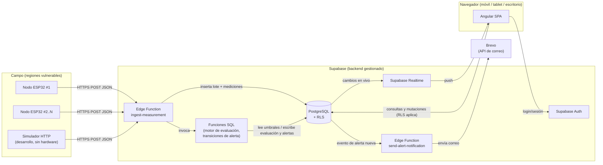
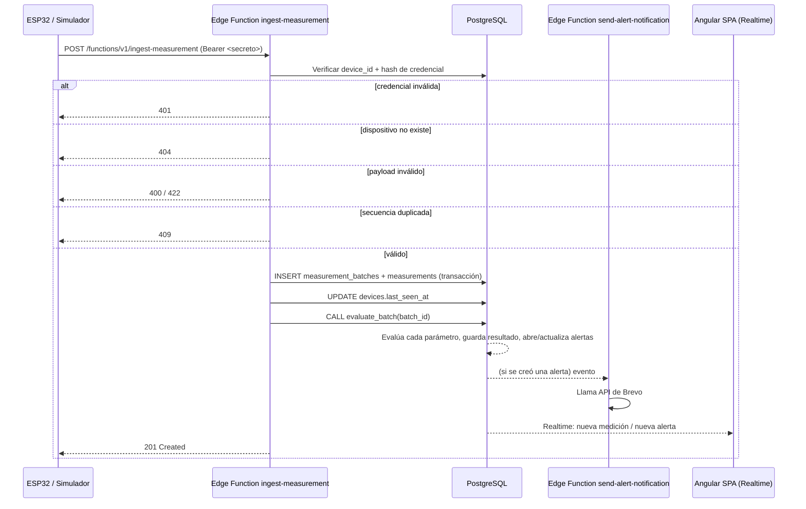

# Arquitectura del Sistema

## 1. Vista general

## 2. Capas y responsabilidades

| Capa | Responsabilidad | Tecnología |
|---|---|---|
| Percepción (hardware) | Captura de pH, oxígeno disuelto, turbidez y temperatura | ESP32 + sensores (ver [MANUAL_ACTIONS.md](MANUAL_ACTIONS.md) #3) |
| Ingesta | Autenticar dispositivo, validar payload, evitar duplicados, persistir de forma transaccional | Supabase Edge Function (Deno + TypeScript) |
| Evaluación | Comparar contra umbrales activos, asignar estado, abrir/actualizar alertas, registrar historial | Función/RPC de PostgreSQL, invocada por la Edge Function de ingesta |
| Persistencia y autorización | Almacenamiento relacional, control de acceso por fila | PostgreSQL (Supabase) + Row Level Security |
| Notificación | Envío de correo al abrirse una alerta | Edge Function + API de Brevo |
| Tiempo real | Propagar cambios a los clientes conectados | Supabase Realtime |
| Presentación | Dashboard, historial, alertas, reportes, administración | Angular SPA (TypeScript) |
| Reportes | Cálculo de estadísticas y generación de archivos | Cliente (Angular) con ExcelJS y pdfmake/jsPDF, a partir de datos ya autorizados por RLS |

## 3. Por qué estas decisiones

- **La evaluación vive en la base de datos, no en Angular ni en la Edge Function de ingesta directamente:** así se garantiza que toda medición —venga de un ESP32 real, del simulador, o de una futura migración de datos— pasa por la misma regla, de forma transaccional y atómica junto con el guardado del lote.
- **Los reportes se generan en el cliente:** evita mantener infraestructura de generación de archivos en el servidor; los datos ya llegan filtrados por RLS, por lo que el archivo generado solo puede contener lo que el usuario tiene permitido ver.
- **REST HTTPS, no MQTT:** decisión explícita del alcance de este proyecto (ver D-006). Supabase Edge Functions exponen HTTPS de forma nativa; añadir un broker MQTT sería infraestructura adicional no requerida en esta primera versión.
- **Realtime en vez de polling:** Supabase Realtime permite refrescar el dashboard sin recargar la página, requisito explícito de la interfaz.

## 4. Selección tecnológica

| Área | Tecnología | Estado de versión |
|---|---|---|
| Frontend | Angular + TypeScript | Se fijará la versión exacta al ejecutar el scaffolding real en Fase 2 (ver D-010); se usará la última versión LTS estable disponible en ese momento. |
| UI | Angular Material (preferido) o Bootstrap | A confirmar en Fase 2 según necesidades de accesibilidad/tema. |
| Backend gestionado | Supabase (PostgreSQL, Auth, Edge Functions, Realtime) | Proyecto cloud gestionado; requiere cuenta (ver MANUAL_ACTIONS.md #1). |
| Autorización | Row Level Security de PostgreSQL | Nativo de Supabase/Postgres. |
| Gráficas | Chart.js (vía `ng2-charts` o wrapper equivalente) | A fijar en Fase 2. |
| Mapa | Leaflet + tiles de OpenStreetMap | Sin costo de licencia; requiere atribución OSM visible en el mapa. |
| Exportación Excel | ExcelJS | Ejecuta en el navegador, sin backend adicional. |
| Exportación PDF | pdfmake o jsPDF | A decidir en Fase 4 según necesidades de maquetado del reporte. |
| Notificaciones | Brevo (API REST) desde una Edge Function | Requiere cuenta y remitente verificado (ver MANUAL_ACTIONS.md #2). |
| Pruebas de API | Colección Postman/Bruno o archivos `.http` versionados en el repo | Se crearán junto con la Edge Function de ingesta (Fase 3). |
| Pruebas E2E | Playwright, si resulta compatible con la estructura elegida | Se evaluará en Fase 5; si no es compatible, se documentará el motivo en DECISIONS.md. |

## 5. Flujo de ingesta (detalle)

## 6. Despliegue (visión preliminar, se detalla en Fase 5)

- Frontend: build estático de Angular servido por un proveedor de hosting a decidir (ver D-009).
- Backend: proyecto Supabase cloud (o local con Supabase CLI durante desarrollo).
- Secretos (clave de Brevo, `service_role key` de Supabase, secretos de dispositivo) viven únicamente como variables de entorno del servidor/Edge Functions, nunca en el bundle de Angular ni en el repositorio.
