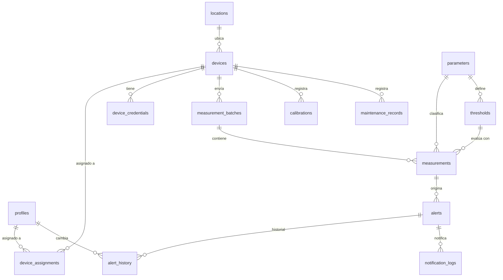

# Diseño de Base de Datos

Motor: PostgreSQL (Supabase). Este documento es el diseño previo a escribir migraciones reales (Fase 2). Los tipos de columna son indicativos y se refinarán al escribir el SQL.

## 1. Convenciones

- Toda tabla usa `id uuid primary key default gen_random_uuid()`, salvo donde se indique lo contrario.
- `created_at timestamptz not null default now()` en todas las tablas; `updated_at timestamptz` en las tablas mutables (mantenido por trigger).
- Los catálogos controlados (rol, severidad, estado de alerta, resultado de evaluación) se modelan como `enum` de PostgreSQL.
- Los datos de demostración se marcan con `is_demo boolean not null default false` y deben poder eliminarse sin afectar datos reales.
- Ningún umbral normativo se preincluye como definitivo: los datos semilla de `thresholds` se insertan con `is_demo = true` y deben ser revisados/reemplazados por un Administrador real.

## 2. Tipos enumerados

| Enum | Valores |
|---|---|
| `user_role` | `admin`, `analyst`, `field_tech` |
| `device_status` | `active`, `inactive` |
| `evaluation_result` | `CONFORME`, `ALERTA`, `CRITICO` |
| `alert_severity` | `WARNING`, `CRITICAL` |
| `alert_status` | `NEW`, `ACKNOWLEDGED`, `ATTENDED`, `CLOSED` |
| `maintenance_type` | `CALIBRATION`, `MAINTENANCE` |
| `notification_status` | `SENT`, `FAILED` |

## 3. Diccionario de datos

### 3.1 `profiles`
Extiende `auth.users` de Supabase con datos de aplicación.

| Columna | Tipo | Notas |
|---|---|---|
| `id` | uuid PK | igual a `auth.users.id` (FK) |
| `full_name` | text | |
| `role` | `user_role` | not null |
| `is_active` | boolean | default true |
| `created_at` / `updated_at` | timestamptz | |

### 3.2 `locations`
| Columna | Tipo | Notas |
|---|---|---|
| `id` | uuid PK | |
| `name` | text | not null |
| `description` | text | |
| `latitude` | numeric(9,6) | not null |
| `longitude` | numeric(9,6) | not null |
| `is_demo` | boolean | |
| `created_at` / `updated_at` | timestamptz | |

### 3.3 `devices`
| Columna | Tipo | Notas |
|---|---|---|
| `id` | uuid PK | |
| `code` | text | **unique**, ej. `NODO-001` |
| `name` | text | |
| `location_id` | uuid FK → locations | nullable (puede darse de alta sin ubicación aún) |
| `status` | `device_status` | default `active` |
| `last_seen_at` | timestamptz | nullable |
| `firmware_version` | text | nullable |
| `is_demo` | boolean | |
| `created_at` / `updated_at` | timestamptz | |

Índices: `unique(code)`, `index(location_id)`, `index(status)`.

### 3.4 `device_credentials`
| Columna | Tipo | Notas |
|---|---|---|
| `id` | uuid PK | |
| `device_id` | uuid FK → devices | not null |
| `secret_hash` | text | not null — hash (p. ej. bcrypt/pgcrypto), **nunca texto plano** |
| `created_at` | timestamptz | |
| `revoked_at` | timestamptz | nullable — credencial rotada/anulada |

Índices: `index(device_id) where revoked_at is null` (credencial vigente).

### 3.5 `device_assignments`
Relación N:M entre técnicos de campo y dispositivos.

| Columna | Tipo | Notas |
|---|---|---|
| `device_id` | uuid FK → devices | |
| `profile_id` | uuid FK → profiles | |
| `assigned_at` | timestamptz | |

Clave primaria compuesta `(device_id, profile_id)`.

### 3.6 `parameters`
Catálogo de los 4 parámetros oficiales (extensible).

| Columna | Tipo | Notas |
|---|---|---|
| `id` | uuid PK | |
| `code` | text | unique — `ph`, `dissolved_oxygen`, `turbidity`, `temperature` |
| `name` | text | nombre visible |
| `unit` | text | `pH`, `mg/L`, `NTU`, `°C` |
| `physical_min` / `physical_max` | numeric | límites físicos plausibles para validar entrada (no normativos), ej. pH entre 0 y 14 |
| `is_active` | boolean | |

### 3.7 `thresholds`
Umbrales configurables y **versionables** por parámetro.

| Columna | Tipo | Notas |
|---|---|---|
| `id` | uuid PK | |
| `parameter_id` | uuid FK → parameters | |
| `version` | integer | correlativo por parámetro |
| `critical_low` | numeric | nullable |
| `warning_low` | numeric | nullable |
| `warning_high` | numeric | nullable |
| `critical_high` | numeric | nullable |
| `consecutive_breaches_to_alert` | integer | default 1 — lecturas consecutivas fuera de rango antes de abrir alerta |
| `is_active` | boolean | solo una versión activa por parámetro a la vez |
| `is_demo` | boolean | |
| `created_by` | uuid FK → profiles | |
| `created_at` | timestamptz | |

Regla de evaluación: `valor < critical_low` o `valor > critical_high` ⇒ `CRITICO`; `valor < warning_low` o `valor > warning_high` (y no crítico) ⇒ `ALERTA`; en otro caso ⇒ `CONFORME`. Cualquiera de los 4 límites puede ser `null` (sin límite en esa dirección).

Índice: `index(parameter_id, is_active)`.

### 3.8 `measurement_batches`
Cabecera de cada lote recibido de un dispositivo.

| Columna | Tipo | Notas |
|---|---|---|
| `id` | uuid PK | |
| `device_id` | uuid FK → devices | not null |
| `sequence` | bigint | not null — número de secuencia enviado por el dispositivo |
| `measured_at` | timestamptz | not null — fecha de medición reportada por el dispositivo |
| `received_at` | timestamptz | not null default now() — fecha de recepción por el servidor |
| `raw_payload` | jsonb | copia del JSON recibido, para auditoría |
| `created_at` | timestamptz | |

Índices: **`unique(device_id, sequence)`** (evita duplicados, sustenta la respuesta 409), `index(device_id, measured_at)`.

### 3.9 `measurements`
Una fila por parámetro dentro de un lote (formato "largo", ver D-004).

| Columna | Tipo | Notas |
|---|---|---|
| `id` | uuid PK | |
| `batch_id` | uuid FK → measurement_batches | not null |
| `parameter_id` | uuid FK → parameters | not null |
| `value` | numeric | not null |
| `evaluation_result` | `evaluation_result` | resultado calculado por el motor |
| `threshold_id_applied` | uuid FK → thresholds | umbral vigente usado para evaluar, conservado aunque el umbral cambie después |
| `created_at` | timestamptz | |

Índices: `index(batch_id)`, `index(parameter_id, created_at)`, `index(evaluation_result)`.

### 3.10 `alerts`
| Columna | Tipo | Notas |
|---|---|---|
| `id` | uuid PK | |
| `device_id` | uuid FK → devices | not null |
| `parameter_id` | uuid FK → parameters | not null |
| `first_measurement_id` | uuid FK → measurements | medición que originó la alerta |
| `severity` | `alert_severity` | |
| `status` | `alert_status` | default `NEW` |
| `opened_at` | timestamptz | |
| `acknowledged_at` / `acknowledged_by` | timestamptz / uuid FK → profiles | nullable |
| `attended_at` / `attended_by` | timestamptz / uuid FK → profiles | nullable |
| `closed_at` / `closed_by` | timestamptz / uuid FK → profiles | nullable |
| `follow_up_comment` | text | nullable |
| `threshold_id_applied` | uuid FK → thresholds | |
| `created_at` / `updated_at` | timestamptz | |

Índices: `index(device_id, status)`, `index(status)`. Regla de no-duplicado: no crear una alerta `NEW`/`ACKNOWLEDGED`/`ATTENDED` nueva si ya existe una en esos estados para el mismo `device_id` + `parameter_id`.

### 3.11 `alert_history`
| Columna | Tipo | Notas |
|---|---|---|
| `id` | uuid PK | |
| `alert_id` | uuid FK → alerts | not null |
| `from_status` | `alert_status` | nullable (null en la apertura) |
| `to_status` | `alert_status` | not null |
| `changed_by` | uuid FK → profiles | nullable (null si el cambio lo origina el sistema, ej. apertura automática) |
| `comment` | text | nullable |
| `changed_at` | timestamptz | |

Índice: `index(alert_id, changed_at)`.

### 3.12 `calibrations`
| Columna | Tipo | Notas |
|---|---|---|
| `id` | uuid PK | |
| `device_id` | uuid FK → devices | |
| `parameter_id` | uuid FK → parameters | nullable (null = calibración general) |
| `performed_at` | timestamptz | |
| `performed_by` | uuid FK → profiles | |
| `notes` | text | |
| `next_due_at` | timestamptz | nullable |

### 3.13 `maintenance_records`
| Columna | Tipo | Notas |
|---|---|---|
| `id` | uuid PK | |
| `device_id` | uuid FK → devices | |
| `type` | `maintenance_type` | |
| `performed_at` | timestamptz | |
| `performed_by` | uuid FK → profiles | |
| `notes` | text | |
| `next_due_at` | timestamptz | nullable |

Índice compartido con calibraciones: `index(device_id, performed_at)`.

### 3.14 `notification_logs`
| Columna | Tipo | Notas |
|---|---|---|
| `id` | uuid PK | |
| `alert_id` | uuid FK → alerts | nullable |
| `recipient` | text | |
| `channel` | text | `email` (único canal en esta versión) |
| `status` | `notification_status` | |
| `provider_message_id` | text | nullable |
| `error_message` | text | nullable — sin credenciales ni payloads sensibles |
| `sent_at` | timestamptz | |

## 4. Diagrama entidad-relación (simplificado)

## 5. Row Level Security (resumen de política; SQL real en Fase 2)

| Tabla | Admin | Analista | Técnico de campo |
|---|---|---|---|
| `profiles` | CRUD todas | SELECT propia, UPDATE propia | SELECT propia, UPDATE propia |
| `locations` | CRUD | SELECT | SELECT |
| `devices` | CRUD | SELECT | SELECT solo si existe en `device_assignments` |
| `device_credentials` | CRUD (solo metadatos; el secreto en claro nunca se devuelve tras su creación) | ❌ | ❌ |
| `device_assignments` | CRUD | SELECT | SELECT propia |
| `parameters` | CRUD | SELECT | SELECT |
| `thresholds` | CRUD | SELECT | ❌ |
| `measurement_batches` / `measurements` | SELECT (insert solo vía `service_role` desde la Edge Function) | SELECT | SELECT solo dispositivos asignados |
| `alerts` | SELECT + UPDATE vía funciones de transición | SELECT + UPDATE vía funciones de transición | SELECT solo dispositivos asignados (propuesta D-007) |
| `alert_history` | SELECT | SELECT | SELECT solo dispositivos asignados |
| `calibrations` / `maintenance_records` | CRUD | SELECT (propuesta D-008) | CRUD solo dispositivos asignados |
| `notification_logs` | SELECT | ❌ | ❌ |

Regla transversal: ninguna tabla de mediciones acepta `INSERT` directo desde el cliente autenticado por usuario; solo la Edge Function de ingesta (con `service_role`) puede insertar, después de autenticar el dispositivo.

## 6. Datos de demostración

Se creará un script de semilla (`supabase/seed.sql`, Fase 2) que inserte 1–2 ubicaciones, 2–3 dispositivos, umbrales por defecto y algunas mediciones de ejemplo, todos con `is_demo = true`. Este script es idempotente y removible sin afectar datos reales. Ningún valor de umbral de este seed debe interpretarse como normativo (ver RNF y D-002/D-009 sobre no afirmar cumplimiento NOM-001).
