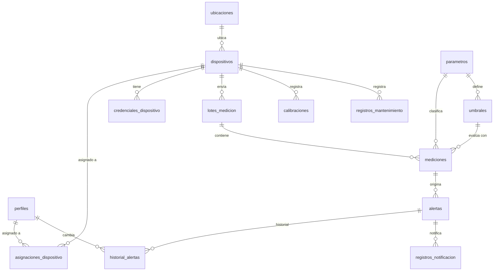

# Diseño de Base de Datos

Motor: PostgreSQL (Supabase). Nombres de tabla, columna y tipos enumerados en español desde D-021 (`20260914120000_spanish_rename.sql`) — requisito institucional para trámites, ver [DECISIONS.md](DECISIONS.md). Se exceptúan los campos técnicos universales (`id`, `created_at`, `updated_at`, `is_active`, `is_demo`), que se quedan en inglés por ser convención estándar de cualquier motor de base de datos, no vocabulario del negocio.

## 1. Convenciones

- Toda tabla usa `id uuid primary key default gen_random_uuid()`, salvo donde se indique lo contrario.
- `created_at timestamptz not null default now()` en todas las tablas; `updated_at timestamptz` en las tablas mutables (mantenido por trigger).
- Los catálogos controlados (rol, gravedad, estado de alerta, resultado de evaluación) se modelan como `enum` de PostgreSQL.
- Los datos de demostración se marcan con `is_demo boolean not null default false` y deben poder eliminarse sin afectar datos reales.
- Ningún umbral normativo se preincluye como definitivo: los datos semilla de `umbrales` se insertan con `is_demo = true` y deben ser revisados/reemplazados por un Administrador real.

## 2. Tipos enumerados

| Enum | Valores |
|---|---|
| `rol_usuario` | `administrador`, `analista`, `tecnico_campo` |
| `estado_dispositivo` | `activo`, `inactivo` |
| `resultado_evaluacion` | `CONFORME`, `ALERTA`, `CRITICO` |
| `gravedad_alerta` | `ALERTA`, `CRITICO` |
| `estado_alerta` | `NUEVA`, `RECONOCIDA`, `ATENDIDA`, `CERRADA` |
| `tipo_mantenimiento` | `CALIBRACION`, `MANTENIMIENTO` |
| `estado_notificacion` | `ENVIADO`, `FALLIDO` |

## 3. Diccionario de datos

### 3.1 `perfiles`
Extiende `auth.users` de Supabase con datos de aplicación.

| Columna | Tipo | Notas |
|---|---|---|
| `id` | uuid PK | igual a `auth.users.id` (FK) |
| `nombre_completo` | text | |
| `correo` | text | denormalizado desde `auth.users.email` (D-021), para poder listar usuarios sin exponer el esquema `auth`. |
| `rol` | `rol_usuario` | not null |
| `is_active` | boolean | default true |
| `created_at` / `updated_at` | timestamptz | |

### 3.2 `ubicaciones`
| Columna | Tipo | Notas |
|---|---|---|
| `id` | uuid PK | |
| `nombre` | text | not null |
| `descripcion` | text | |
| `latitud` | numeric(9,6) | not null |
| `longitud` | numeric(9,6) | not null |
| `is_demo` | boolean | |
| `created_at` / `updated_at` | timestamptz | |

### 3.3 `dispositivos`
| Columna | Tipo | Notas |
|---|---|---|
| `id` | uuid PK | |
| `codigo` | text | **unique**, ej. `NODO-001` |
| `nombre` | text | |
| `ubicacion_id` | uuid FK → ubicaciones | nullable (puede darse de alta sin ubicación aún) |
| `estado` | `estado_dispositivo` | default `activo` |
| `ultima_comunicacion` | timestamptz | nullable |
| `version_firmware` | text | nullable |
| `is_demo` | boolean | |
| `created_at` / `updated_at` | timestamptz | |

Índices: `unique(codigo)`, `index(ubicacion_id)`, `index(estado)`.

### 3.4 `credenciales_dispositivo`
| Columna | Tipo | Notas |
|---|---|---|
| `id` | uuid PK | |
| `dispositivo_id` | uuid FK → dispositivos | not null |
| `hash_secreto` | text | not null — hash (p. ej. bcrypt/pgcrypto), **nunca texto plano** |
| `created_at` | timestamptz | |
| `revocado_en` | timestamptz | nullable — credencial rotada/anulada |

Índices: `index(dispositivo_id) where revocado_en is null` (credencial vigente).

### 3.5 `asignaciones_dispositivo`
Relación N:M entre técnicos de campo y dispositivos.

| Columna | Tipo | Notas |
|---|---|---|
| `dispositivo_id` | uuid FK → dispositivos | |
| `perfil_id` | uuid FK → perfiles | |
| `asignado_en` | timestamptz | |

Clave primaria compuesta `(dispositivo_id, perfil_id)`.

### 3.6 `parametros`
Catálogo de los 4 parámetros oficiales (extensible).

| Columna | Tipo | Notas |
|---|---|---|
| `id` | uuid PK | |
| `codigo` | text | unique — `ph`, `oxigeno_disuelto`, `turbidez`, `temperatura` |
| `nombre` | text | nombre visible |
| `unidad` | text | `pH`, `mg/L`, `NTU`, `°C` |
| `minimo_fisico` / `maximo_fisico` | numeric | límites físicos plausibles para validar entrada (no normativos), ej. pH entre 0 y 14 |
| `is_active` | boolean | |

### 3.7 `umbrales`
Umbrales configurables y **versionables** por parámetro.

| Columna | Tipo | Notas |
|---|---|---|
| `id` | uuid PK | |
| `parametro_id` | uuid FK → parametros | |
| `version` | integer | correlativo por parámetro |
| `critico_bajo` | numeric | nullable |
| `alerta_bajo` | numeric | nullable |
| `alerta_alto` | numeric | nullable |
| `critico_alto` | numeric | nullable |
| `lecturas_consecutivas_alerta` | integer | default 1 — lecturas consecutivas fuera de rango antes de abrir alerta |
| `is_active` | boolean | solo una versión activa por parámetro a la vez |
| `is_demo` | boolean | |
| `creado_por` | uuid FK → perfiles | |
| `created_at` | timestamptz | |

Regla de evaluación: `valor < critico_bajo` o `valor > critico_alto` ⇒ `CRITICO`; `valor < alerta_bajo` o `valor > alerta_alto` (y no crítico) ⇒ `ALERTA`; en otro caso ⇒ `CONFORME`. Cualquiera de los 4 límites puede ser `null` (sin límite en esa dirección).

Índice: `index(parametro_id, is_active)`.

### 3.8 `lotes_medicion`
Cabecera de cada lote recibido de un dispositivo.

| Columna | Tipo | Notas |
|---|---|---|
| `id` | uuid PK | |
| `dispositivo_id` | uuid FK → dispositivos | not null |
| `secuencia` | bigint | not null — número de secuencia enviado por el dispositivo |
| `medido_en` | timestamptz | not null — fecha de medición reportada por el dispositivo |
| `recibido_en` | timestamptz | not null default now() — fecha de recepción por el servidor |
| `carga_original` | jsonb | copia del JSON recibido, para auditoría |
| `created_at` | timestamptz | |

Índices: **`unique(dispositivo_id, secuencia)`** (evita duplicados, sustenta la respuesta 409), `index(dispositivo_id, medido_en)`.

### 3.9 `mediciones`
Una fila por parámetro dentro de un lote (formato "largo", ver D-004).

| Columna | Tipo | Notas |
|---|---|---|
| `id` | uuid PK | |
| `lote_id` | uuid FK → lotes_medicion | not null |
| `parametro_id` | uuid FK → parametros | not null |
| `valor` | numeric | not null |
| `resultado_evaluacion` | `resultado_evaluacion` | resultado calculado por el motor |
| `umbral_aplicado_id` | uuid FK → umbrales | umbral vigente usado para evaluar, conservado aunque el umbral cambie después |
| `created_at` | timestamptz | |

Índices: `index(lote_id)`, `index(parametro_id, created_at)`, `index(resultado_evaluacion)`.

### 3.10 `alertas`
| Columna | Tipo | Notas |
|---|---|---|
| `id` | uuid PK | |
| `dispositivo_id` | uuid FK → dispositivos | not null |
| `parametro_id` | uuid FK → parametros | not null |
| `primera_medicion_id` | uuid FK → mediciones | medición que originó la alerta |
| `gravedad` | `gravedad_alerta` | |
| `estado` | `estado_alerta` | default `NUEVA` |
| `abierta_en` | timestamptz | |
| `reconocida_en` / `reconocida_por` | timestamptz / uuid FK → perfiles | nullable |
| `atendida_en` / `atendida_por` | timestamptz / uuid FK → perfiles | nullable |
| `cerrada_en` / `cerrada_por` | timestamptz / uuid FK → perfiles | nullable |
| `comentario_seguimiento` | text | nullable |
| `umbral_aplicado_id` | uuid FK → umbrales | |
| `created_at` / `updated_at` | timestamptz | |

Índices: `index(dispositivo_id, estado)`, `index(estado)`. Regla de no-duplicado: no crear una alerta `NUEVA`/`RECONOCIDA`/`ATENDIDA` nueva si ya existe una en esos estados para el mismo `dispositivo_id` + `parametro_id`.

### 3.11 `historial_alertas`
| Columna | Tipo | Notas |
|---|---|---|
| `id` | uuid PK | |
| `alerta_id` | uuid FK → alertas | not null |
| `estado_origen` | `estado_alerta` | nullable (null en la apertura) |
| `estado_destino` | `estado_alerta` | not null |
| `cambiado_por` | uuid FK → perfiles | nullable (null si el cambio lo origina el sistema, ej. apertura automática) |
| `comentario` | text | nullable |
| `cambiado_en` | timestamptz | |

Índice: `index(alerta_id, cambiado_en)`.

### 3.12 `calibraciones`
| Columna | Tipo | Notas |
|---|---|---|
| `id` | uuid PK | |
| `dispositivo_id` | uuid FK → dispositivos | |
| `parametro_id` | uuid FK → parametros | nullable (null = calibración general) |
| `realizada_en` | timestamptz | |
| `realizada_por` | uuid FK → perfiles | |
| `notas` | text | |
| `proxima_fecha` | timestamptz | nullable |

### 3.13 `registros_mantenimiento`
| Columna | Tipo | Notas |
|---|---|---|
| `id` | uuid PK | |
| `dispositivo_id` | uuid FK → dispositivos | |
| `tipo` | `tipo_mantenimiento` | |
| `realizado_en` | timestamptz | |
| `realizado_por` | uuid FK → perfiles | |
| `notas` | text | |
| `proxima_fecha` | timestamptz | nullable |

Índice compartido con calibraciones: `index(dispositivo_id, realizado_en)`.

### 3.14 `registros_notificacion`
| Columna | Tipo | Notas |
|---|---|---|
| `id` | uuid PK | |
| `alerta_id` | uuid FK → alertas | nullable |
| `destinatario` | text | |
| `canal` | text | `email` (único canal en esta versión) |
| `estado` | `estado_notificacion` | |
| `id_mensaje_proveedor` | text | nullable |
| `mensaje_error` | text | nullable — sin credenciales ni payloads sensibles |
| `enviado_en` | timestamptz | |

## 4. Diagrama entidad-relación (simplificado)

## 5. Row Level Security (resumen de política)

| Tabla | Admin | Analista | Técnico de campo |
|---|---|---|---|
| `perfiles` | CRUD todas | SELECT propia, UPDATE propia | SELECT propia, UPDATE propia |
| `ubicaciones` | CRUD | SELECT | SELECT |
| `dispositivos` | CRUD | SELECT | SELECT solo si existe en `asignaciones_dispositivo` |
| `credenciales_dispositivo` | CRUD (solo metadatos; el secreto en claro nunca se devuelve tras su creación) | ❌ | ❌ |
| `asignaciones_dispositivo` | CRUD | SELECT | SELECT propia |
| `parametros` | CRUD | SELECT | SELECT |
| `umbrales` | CRUD | SELECT | ❌ |
| `lotes_medicion` / `mediciones` | SELECT (insert solo vía `service_role` desde la Edge Function) | SELECT | SELECT solo dispositivos asignados |
| `alertas` | SELECT + UPDATE vía funciones de transición | SELECT + UPDATE vía funciones de transición | SELECT solo dispositivos asignados (propuesta D-007) |
| `historial_alertas` | SELECT | SELECT | SELECT solo dispositivos asignados |
| `calibraciones` / `registros_mantenimiento` | CRUD | SELECT (propuesta D-008) | CRUD solo dispositivos asignados |
| `registros_notificacion` | SELECT | ❌ | ❌ |

Regla transversal: ninguna tabla de mediciones acepta `INSERT` directo desde el cliente autenticado por usuario; solo la Edge Function de ingesta (con `service_role`) puede insertar, después de autenticar el dispositivo.

Las funciones auxiliares que evalúan estas políticas (`es_administrador()`, `es_analista()`, `es_dispositivo_asignado()`, `rol_actual()`) viven en `20260914120000_spanish_rename.sql` (antes `is_admin()`/`is_analyst()`/`is_device_assigned()`/`current_role()`, ver D-021).

## 6. Datos de demostración

`supabase/seed.sql` inserta 2 ubicaciones, 1 dispositivo, umbrales por defecto y un lote de mediciones de ejemplo, todos con `is_demo = true`. Este script es idempotente y removible sin afectar datos reales. Ningún valor de umbral de este seed debe interpretarse como normativo (ver RNF y D-002/D-009 sobre no afirmar cumplimiento NOM-001).
